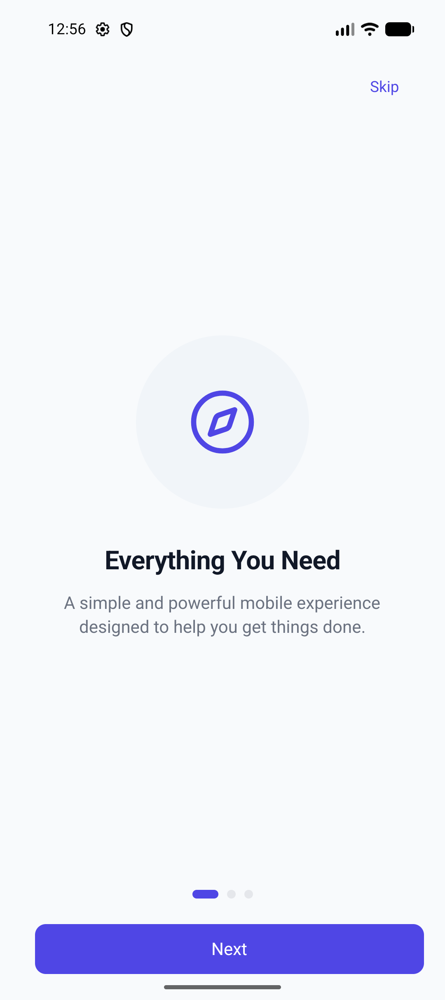
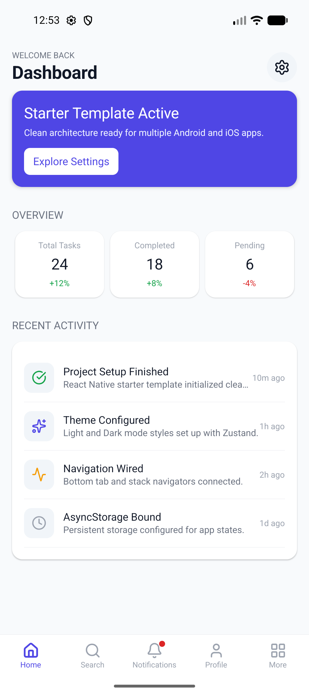
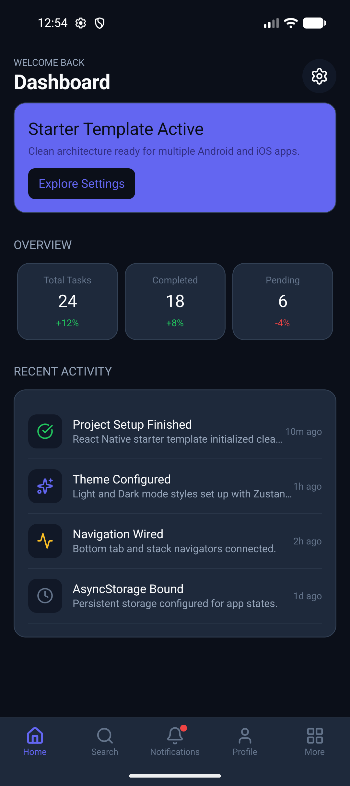
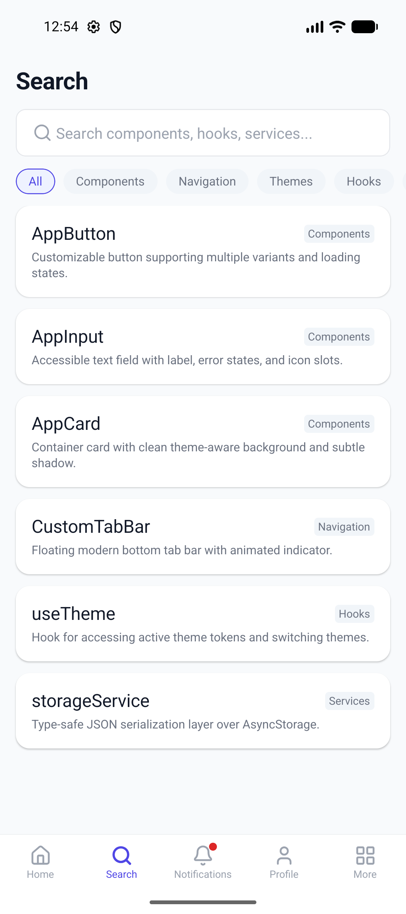
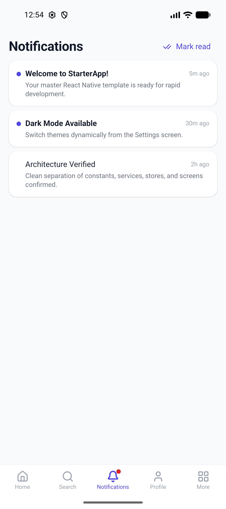
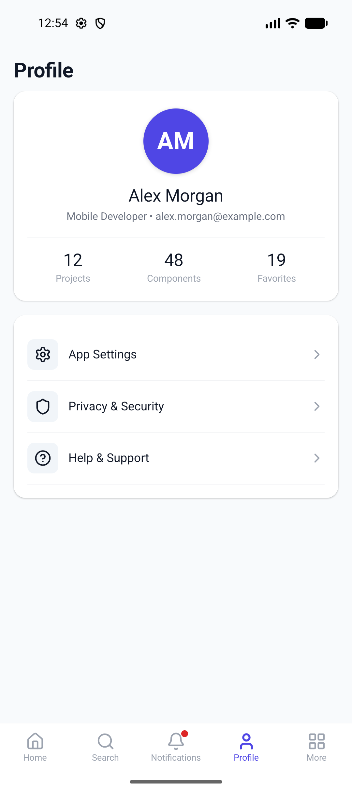
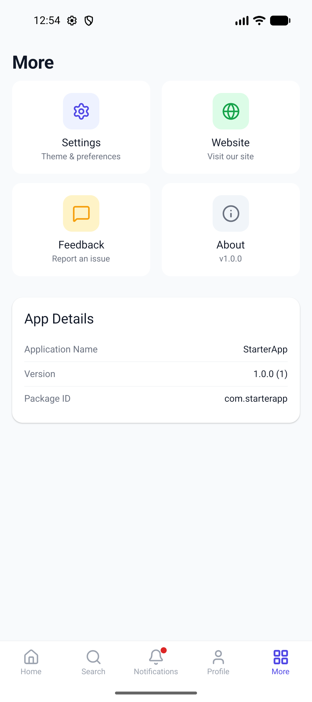
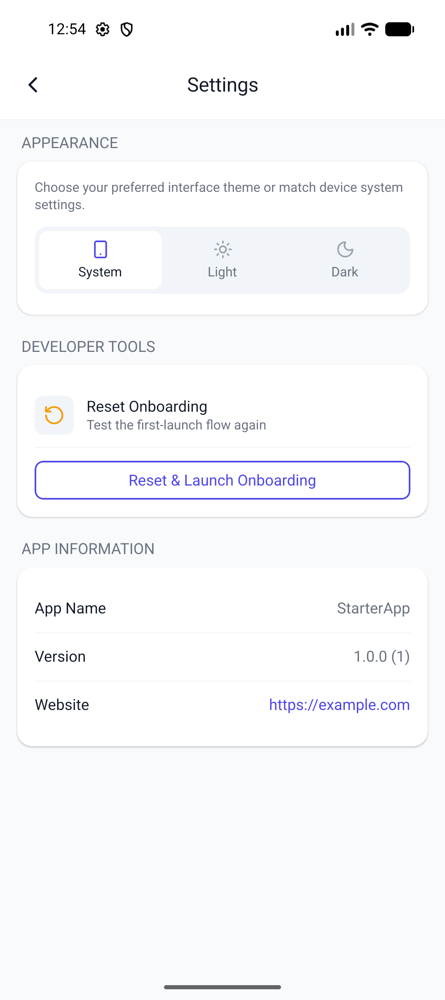
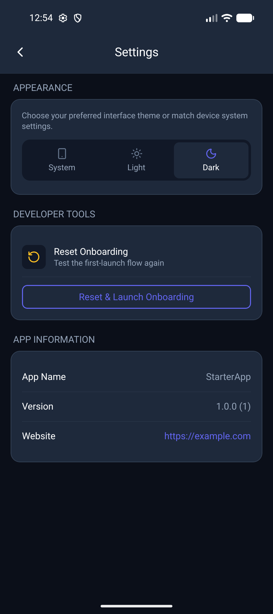
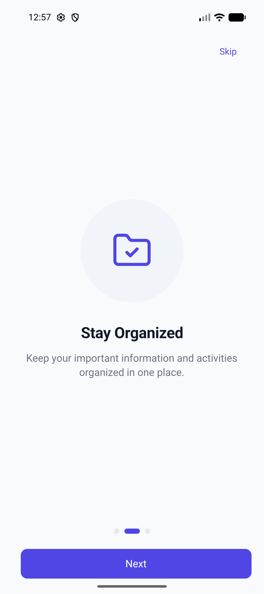

# react-native-template

A **production-ready React Native CLI boilerplate** you can clone and rebrand for many Android & iOS apps.

Built for speed: clean architecture, reusable UI, theming, navigation, local storage, and ready-made **QA + Play Store** build workflows — all in **pure JavaScript** (`.js` / `.jsx`).

Inspired by starters like [atliq/react-native-app-starter](https://github.com/atliq/react-native-app-starter), but focused on a shippable app shell (splash → onboarding → tabs) with modern tooling.

---

## Getting Started

```bash
# Clone the template
git clone https://github.com/<your-username>/react-native-template.git MyApp
cd MyApp

# Install dependencies
npm install

# Start Metro
npm start

# Run on Android
npm run android

# Run on iOS (macOS)
npm run ios:pods
npm run ios
```

> Node **≥ 22.11.0** recommended.

---

## Directory Structure

```text
root
├── android/                 # Native Android (qa + prod flavors)
├── ios/                     # Native iOS (StarterApp)
├── __tests__/               # Jest unit & component tests
├── src/
│   ├── assets/              # Images, icons, fonts
│   ├── components/
│   │   ├── common/          # AppText, AppButton, AppCard, AppInput, …
│   │   ├── navigation/      # CustomTabBar
│   │   └── onboarding/      # OnboardingPagination
│   ├── config/
│   │   └── appConfig.js     # App name, version, URLs, feature flags
│   ├── constants/           # Colors, spacing, typography, routes
│   ├── data/                # Mock seed data
│   ├── hooks/               # useTheme, useAppState, useKeyboard
│   ├── navigation/          # Root / Main / Bottom tabs
│   ├── screens/
│   │   ├── Splash/
│   │   ├── Onboarding/
│   │   ├── Auth/                # Login + Signup
│   │   ├── Home/
│   │   ├── Search/
│   │   ├── Notifications/
│   │   ├── Profile/
│   │   ├── More/
│   │   └── Settings/
│   ├── services/            # AsyncStorage wrapper
│   ├── store/               # Zustand (app + theme)
│   ├── styles/              # Shared component styles
│   ├── theme/               # Light / dark theme tokens
│   └── utils/               # Helpers & platform utils
├── App.jsx
├── index.js
├── BUILD.md
└── package.json
```

---

## Preconfigured with

* Latest React Native (CLI) + React 19
* **100% JavaScript** — no TypeScript setup required
* Splash → Onboarding → Login/Signup → Tabs
* Zustand state management (+ local auth store)
* AsyncStorage persistence
* Light / Dark / System theme
* Bottom tabs + stack navigation (React Navigation 7)
* Reusable UI kit (`AppText`, `AppButton`, `AppCard`, `AppInput`, …)
* Central design tokens (colors, spacing, typography)
* Feature toggles (`enableSearch`, `enableNotifications`)
* Android **QA** + **Prod** flavors (side-by-side install)
* Play Store AAB / APK scripts
* iOS archive / IPA scripts
* Jest test suite

---

## Predefined UI

<details open>
<summary><strong>Expand for screenshots</strong></summary>

<br/>

| Onboarding | Home (Light) | Home (Dark) |
|:---:|:---:|:---:|
|  |  |  |

| Search | Notifications | Profile |
|:---:|:---:|:---:|
|  |  |  |

| More | Settings (Light) | Settings (Dark) |
|:---:|:---:|:---:|
|  |  |  |

| Onboarding (slide 2) |
|:---:|
|  |

</details>

| Flow | Screens |
|------|---------|
| Launch | Splash |
| First run | Onboarding (3 slides) |
| Auth | Login · Signup |
| Main tabs | Home (Dashboard) · Search · Notifications · Profile · More |
| Stack | Settings (theme picker + sign out) |

App flow:

```text
APP LAUNCH
    │
    ▼
  SPLASH  →  initialize storage + theme + auth
    │
    ├── first launch ──► ONBOARDING ──► LOGIN / SIGNUP ──► DASHBOARD
    │
    └── returning user ────────────────► (session?) ──► DASHBOARD
                                         └── no session ► LOGIN
```

---

## Create a new app (rebrand)

### 1. Update app config

Edit [`src/config/appConfig.js`](src/config/appConfig.js):

```js
export const appConfig = {
  appName: 'YourAppName',
  appTagline: 'Your tagline here',
  version: '1.0.0',
  buildNumber: '1',
  packageId: 'com.yourcompany.yourapp',
  supportEmail: 'support@yourdomain.com',
  websiteUrl: 'https://yourdomain.com',
  features: {
    enableSearch: true,
    enableNotifications: true,
  },
};
```

### 2. Customize brand colors

Edit [`src/constants/colors.js`](src/constants/colors.js) — light + `colors.dark` drive the whole theme.

### 3. Update content

* Splash → `src/screens/Splash/`
* Onboarding slides → `src/screens/Onboarding/onboardingData.js`
* Screens → `src/screens/`

### 4. Change native package / bundle ID

| Platform | Where |
|----------|--------|
| Android | `applicationId` in `android/app/build.gradle` |
| iOS | `PRODUCT_BUNDLE_IDENTIFIER` in Xcode (`com.starterapp` by default) |
| Display name | `app.json`, Android `strings.xml`, iOS `PRODUCT_NAME` |

Keep `appConfig.packageId` in sync with native IDs.

---

## Build commands

### Android

| Goal | Command |
|------|---------|
| Local emulator (dev) | `npm run android` |
| QA APK (real phone) | `npm run android:qa` |
| Prod APK | `npm run android:prod` |
| Play Store AAB | `npm run android:prod:aab` |
| Clean | `npm run android:clean` |

| Flavor | Application ID | Purpose |
|--------|----------------|---------|
| `qa` | `com.starterapp.qa` | Internal testing (installs beside prod) |
| `prod` | `com.starterapp` | Store release |

### iOS

```bash
npm run ios:pods      # CocoaPods
npm run ios           # Simulator / device
npm run ios:archive   # .xcarchive
npm run ios:ipa       # Export IPA
```

Full signing & CI notes → [`BUILD.md`](./BUILD.md)

---

## Android release signing

```bash
# 1. Generate keystore (once — keep forever)
keytool -genkey -v -keystore android/app/release.keystore \
  -alias my-key-alias -keyalg RSA -keysize 2048 -validity 10000

# 2. Create credentials file (gitignored)
cp android/keystore.properties.example android/keystore.properties
# → fill in passwords

# 3. Build for Play Store
npm run android:prod:aab
```

⚠️ Never commit `keystore.properties` or `release.keystore`.

---

## Screen styling convention

```js
// Screen.jsx
const { theme } = useTheme();
const styles = createStyles(theme);

// styles.js
export const createStyles = theme =>
  StyleSheet.create({
    container: {
      flex: 1,
      backgroundColor: theme.background,
    },
  });
```

---

## Testing

```bash
npm test
npm run test:coverage
```

---

## About

This template gives you a solid cross-platform app shell out of the box: theming, navigation, persistence, UI components, and production build scripts — so you spend time on product features, not boilerplate.

### Suggested GitHub topics

`react-native` · `react-native-template` · `react-native-boilerplate` · `javascript` · `mobile` · `android` · `ios` · `zustand` · `starter`

### Suggested repo description

> Production-ready React Native CLI starter — JS only. Splash, onboarding, tabs, dark mode, QA + Play Store builds. Clone → rebrand → ship.

---

## License

MIT — use it freely for personal and commercial apps.
